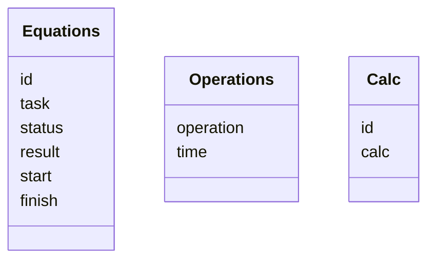

## Развертывание
1. Склонируйте репозиторий
2. Установите зависимости
```bash
go mod download
```
3. Запустите сервер
```bash
go run main.go
```
4. После запуска автоматически создадутся таблицы в базе данных
## Использование
Сервер доступен по адресу `http://localhost:8080`
На главной странице присутствует возможность добавления новых выражений
## Структура проекта

## Принцип работы Агента
- Первичнаяя обработка `((( 2,6 +2,0) + 1,2))` -> `(2.6+2.0)+1.2`
- Вычисление
Вычисление производится рекурсивно. Сначала происходит проход по выражению и ищется последняя операция, дальше это выражение делится на часть до этой операции и после и вызывается тот же самый алгоритм, только уже от этих двух частей. Результаты этих функций дальше попадают в соответствующую функцию вычисления. Если в выражении нет операций, то возвращается само число.
